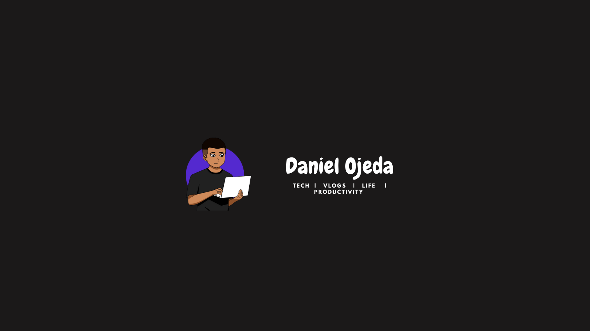

<h1 align="center"> Hey there! I'm Daniel Ojeda. 👨‍💻</h1>

<h3 align="center">A young and passionate technology and programming enthusiast from Colombia</h3>

- 🔭 I’m currently working on improving my skills in programming and mathematics :)
- 🌱 Additionally, I am learning new and exciting things like React, Python, and the basics of AI and English. Who knows, maybe in the not-so-distant future I'll be able to build a robot to do my homework! 🤖
- ⚡ Fun fact: I am 18 years old, I live in Bogota, I love everything related to artificial intelligence, basketball, music and my favorite drink is Latte Macchiato, so if we ever meet, invite me to one!

<h3 align="center" style="padding: 10px;">🛠️ Languages and Tools:</h3>

 

<!---
Dlanmi/Dlanmi is a ✨ special ✨ repository because its `README.md` (this file) appears on your GitHub profile.
You can click the Preview link to take a look at your changes.
--->
